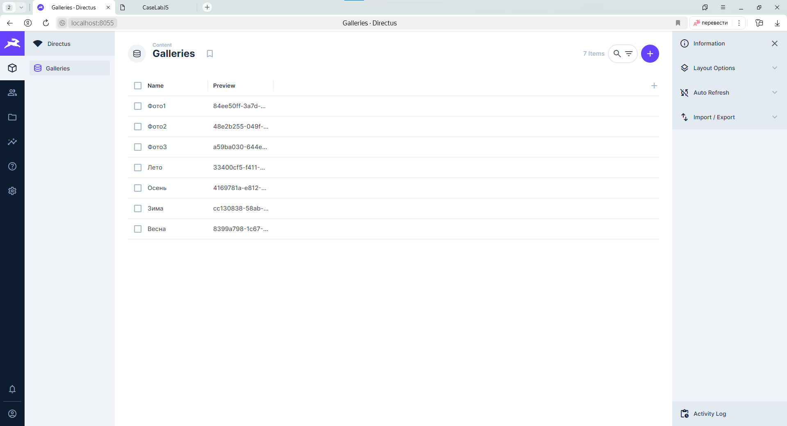
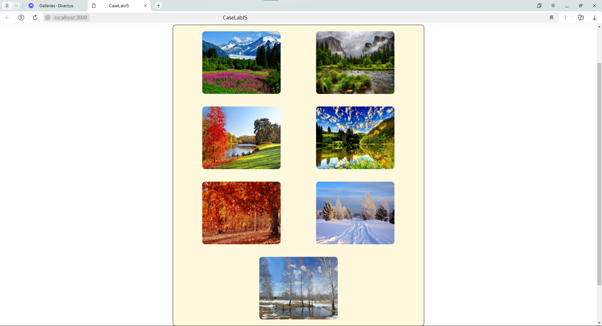
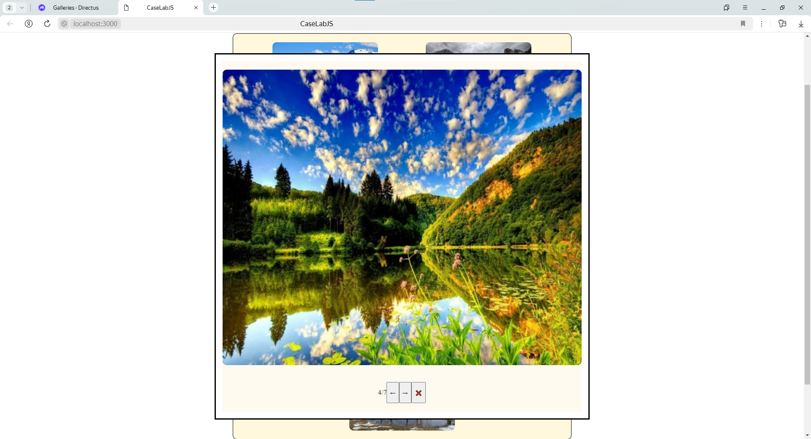

# CaseLabJS
 ## a) описание решения:
Веб-сайт галерея на основе React, который отображает список изображений, 
полученных из Self-hosted Directus (API). Веб-сайт имеет модальную функцию, 
которая позволяет пользователям просматривать изображения 
в увеличенном формате и перемещаться по изображениям 
с помощью кнопок "стрелка влево" и "стрелка вправо".  
App.js : Основной компонент React, 
который отображает галерею изображений и модальный режим. 
Он использует observer из mobx-react-lite для наблюдения за 
хранилищем и повторного отображения компонента при изменении хранилища.  
store.js : Хранилище MobX, которое управляет состоянием приложения, 
включая список изображений, индекс текущего изображения и видимость 
в режиме реального времени. 
Оно также предоставляет методы для выборки изображений, 
отображения и скрытия модального режима и навигации по изображениям.  
В файле docker-compose.yml определены две службы: directus и react. 
Служба directus запускает Self-hosted Directus, 
а служба react запускает приложение React.
Dockerfile используется для создания образа приложения React.
## b) инструкция по запуску приложения
1) скопировать репозиторий
```console
https://github.com/AlphaRasch/CaseLabJS.git
```
2) перейти в директорию CaseLabJS
```console
cd CaseLabJS
```
3) запустить сборку контейнера
```console
docker compose up -d
```
4) когда оба контейнера будут запущены перейти по адресу   
http://localhost:8055  
затем авторизоваться(обязательное действие, иначе приложение не сможет загрузить фотографии)  
Логин:
```console
admin@example.com
```
Пароль:
```console
CaseLabJS
```
После авторизации перейти по адресу  
http://localhost:3000
## c) скрины работающего приложения
  
  
  